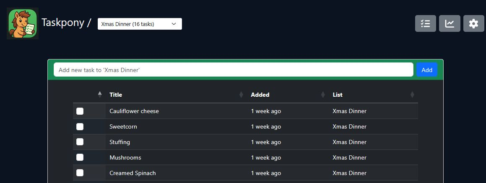
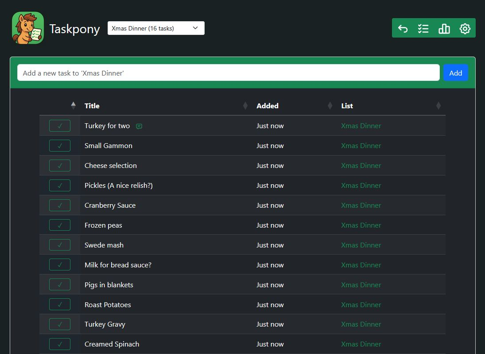
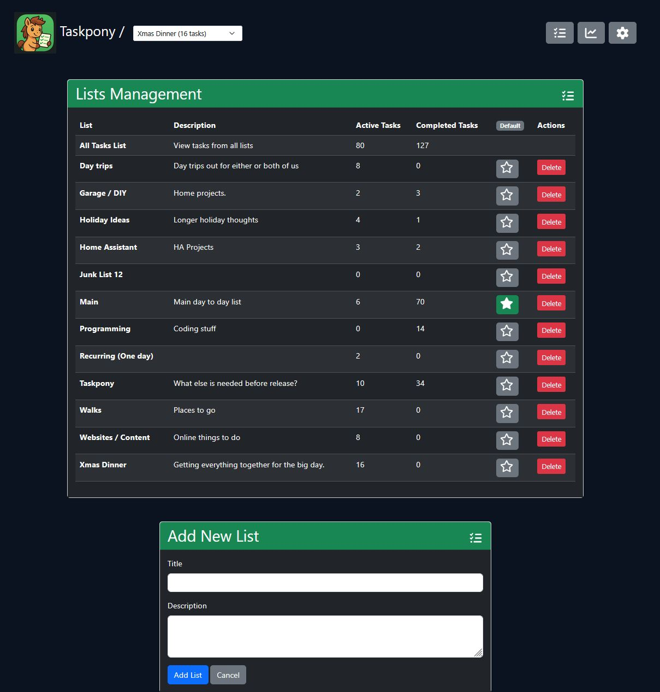
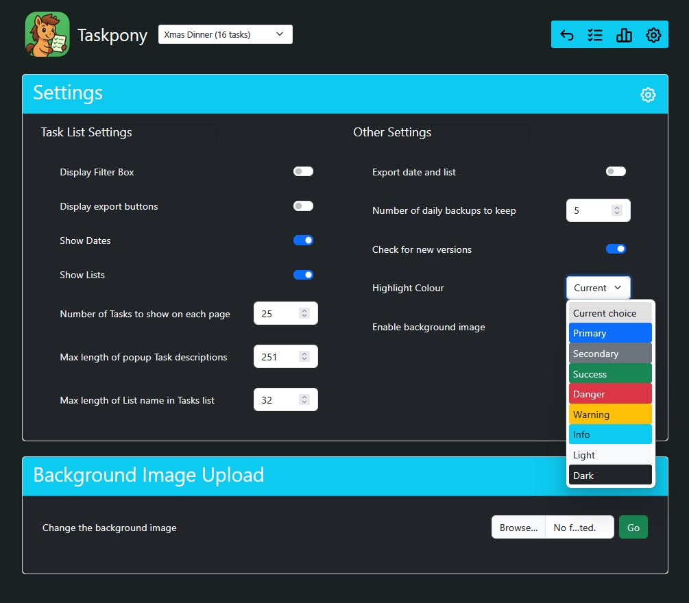
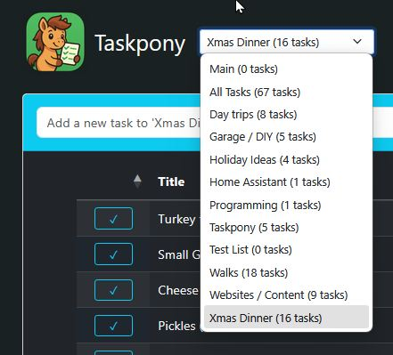

# Taskpony
> "A small and simple self-hosted personal tasks organiser"



# Features

Taskpony is intended to be small, easy to install and operate with a clean and intuitive interface. It wants to do one thing well - add, display and complete tasks. 

Taskpony supports unlimited Tasks organised within unlimited Lists, and free movement of tasks within Lists. Tasks can be exported to the clipboard, CSV, PDF or cleanly printed.

No phone app required. The interface is responsive and scales well to phones. There are no trackers and does not require access to the internet to function; all required files are contained.

See some more [Screenshots](#screenshots)

**Quick start** - Deploy using [Docker Compose](#docker-compose) and visit port 5000. 

## Table of contents 

- [Features](#features)
- [Security](#security)
- [Installation](#installation)
  - [Requirements](#requirements)
  - [Docker](#docker)
  - [Docker Compose](#docker-compose)
  - [Linux service](#linux-service)
- [Troubleshooting](#troubleshooting)
- [FAQ](#faq)
- [Upgrading](#upgrading)
- [Documentation](#documentation)
- [Roadmap](#roadmap)
- [Screenshots](#screenshots)
- [Schema](#schema)
- [Web paths](#web-paths)
- [Credits](#credits)
- [Licence](#licence)

# Security 

Part of Taskpony's design choice is that there are no authentication systems built in. If you require authentication, such as a multi-user LAN or you are accessing Taskpony from the internet, you are strongly encouraged to use a reverse proxy with authentication in front of it. This could be [Nginx Proxy Manager](https://nginxproxymanager.com/), [Apache](https://httpd.apache.org/) configured to operate with a reverse proxy, or a cloud solution such as [Cloudflare Tunnels](https://www.cloudflare.com) protected by an Access policy.

# Installation

Taskpony is intended to be easy to install and maintain. We document two ways to install it, using Docker or as a standalone Linux systemd service. 

# Requirements

Taskpony needs very little to run. 
* Disk space: The first release docker image is around 500Mb, but installing as systemd will need a lot less, around 200kb including the initial database. Obviously, more tasks = more disk space used by the database, but even so, it's KBs, not MBs unless you really have a lot to do!
* Memory: Around 30MB (systemd or docker)
* CPU: Almost any CPU will be fast enough.
* Clients: Browsers will typically use around 2-3MB of memory to load and display Taskpony.

## Limits

Taskpony has no artificial limits beyond those of the technologies, mostly SQLite. These are theoretically;

- Tasks and Lists - a maximum of 9.22 quintillian of each. 
- Text for each task or list's title or description can be up to a billion characters each. (Truncated in tables, but not everywhere. It's hoped users will be sane.)

In reality, disk i/o performance is likely to be the limiting factor long before the above is reached.

## Docker

> The latest version of Taskpony is on [Dockerhub](https://hub.docker.com/repositories/digdilem) as `digdilem/taskpony:latest`

Install docker and run something like the following. 

`docker run -d -p 5000:5000 digdilem/taskpony:latest`

Within a few seconds, Taskpony should be available to your web browser on port 5000

If you want it to run on a different port, change the *first* 5000 to something else.

## Docker Compose

There is an example `docker-compose.yml` file in the repository. 

Copy this to your chosen directory, inspect and adjust as desired, and run: `docker compose up -d`

On completion, Taskpony should be available on http://localhost:5000 

The default version mounts a persistant volume in `./data` where the Sqlite database `taskpony.db` will be created automatically.

## Linux Service

Taskpony expects to be installed in `/opt/taskpony`. 

### Installing it elsewhere than /opt/taskpony

If you want it to exist elsewhere, you'll need to 

A) Edit `taskpony.psgi` and change `my $db_path = '/opt/taskpony/db/taskpony.db';` to point to the intended location of the database file that Taskpony will create.

B) Amend `taskpony.service` and change these lines to match your new path:

```
ExecStart=/usr/bin/plackup -r -p 5000 /opt/taskpony/taskpony.psgi
WorkingDirectory=/opt/taskpony
```

## Installing the program

1. Make the directory and pull the files in from Github

EITHER: using git clone:

```
cd /opt
apt-get install -y git
git clone https://github.com/digdilem/taskpony.git
```

OR, Download the zip from https://github.com/digdilem/taskpony and unpack into /opt/taskpony
```
cd /opt/
wget https://codeload.github.com/digdilem/taskpony/zip/refs/heads/main
unzip -a main
mv taskpony-main taskpony
```

2. Install the perl modules that taskpony requires

```
apt-get install libdbi-perl libdbd-sqlite3-perl libplack-perl perl
```

3. Copy the supplied `taskpony.service` to `/etc/systemd/system` and start and enable it

```
cp /opt/taskpony/taskpony.service /etc/systemd/system
systemctl daemon-reload
systemctl enable --now taskpony
```

4. Visit port 5000 of that machine with your web browser. Eg, if it's localhost: `http://localhost:5000` and you should see Taskpony initial list.

Or if it's on a machine with an IP of 10.0.0.16, then `http://10.0.0.16:5000` - etc.

If you want to use another port instead of 5000, edit `taskpony.service` and change the plackup line. Eg: `ExecStart=/usr/bin/plackup -r -p 5001 /opt/taskpony/taskpony.psgi`

If you wish to run Taskpony in a directory other than `/opt/taskpony`, then change `$db_path` in `taskpony.psgi` and `WorkingDirectory` in `taskpony.service`

# Troubleshooting

If Taskpony doesn't work as expected, then:

## Docker

See output logs with `docker compose logs`

## Systemd

See output logs with `journalctl -u taskpony` or the current status with `systemctl status taskpony`

# FAQ

> How can I tell you about bugs or suggest improvements? 

Please do! The best place is to use [Github issues](https://github.com/digdilem/taskpony/issues)

> How do I back up my tasks?

All tasks, lists and settings are kept within the single file, `taskpony.db`. This can be copied somewhere safe to back it up. If you need to restore a backup, just copy that file to where Taskpony expects it and restart it.

> Is there an Android or IOS app?

Sorry, no. Taskpony was designed to be a responsive web app and works well on both desktop and smaller devices, so an app is not considered necessary. (If you use a phone for your tasks as I do, create a shortcut on the desktop the Taskpony so it instantly opens in a browser)   If anyone wants to create an app for Taskpony, that's great, and if it's good I'll reference it here.

> When will support for multiple users, groups or teams be added?

Never, sorry. This is a hard design choice to keep Taskpony small and simple and to avoid bloat. There are a lot of alternative projects with groupware ability if it is important to you.

> How do I add HTTPS? 

Use a reverse proxy - see [#security](#security)

> How do I protect my Taskpony with a username and password?

Use a reverse proxy - see [#security](#security)

> Does Taskpony support Caldav?

No. It may do in the future but there are no initial plans to do so.

> Can I use a different database type?

Not presently. SQLite was chosen to keep things small and simple. I think it should suffice for a task application.

# Upgrading

Upgrading Taskpony should be quite simple - overwrite the files and ensure taskpony.db survives. 

## Linux 

Follow the installation steps above and copy the new files over the existing ones. It's recommended that you back up the database first, but taskpony should automatically upgrade that if its needed. 

## Docker

Stop the existing container and repeat the installation instructions to pull the new image.

## Docker-Compose

Change to the directory you put your `docker-compose.yml`

Check the compose file with that of the new version and overwrite it if it's changed, then:

```
docker compose down
docker compose pull
docker compose up -d
```

# Documentation

Follow the [install guides](#installation) above, and you should be able to access Taskpony on http port 5000 with your web browser.

## About Tasks

The default page shows a pulldown menu at the top with an entry for the Default List (change this in the Lists page) followed by "All Lists" followed by an alpha-sorted list of the remaining Lists.

Below that is a quick entry form that allows you to add a task to the current list. Because it's autofocused, you can enter multiple tasks by typing, hitting enter, then typing the next one without needing to reselect with the mouse. This form will be missing if "All lists" is selected. 

Then the main tasks lists is shown. Tick the checkbox to mark a task as *completed* which removes it from the *active* tasks. 

A Filter or Search box is displayed top right if `Display Search Box` is selected in Settings that will only display matching strings.

Hover over the task Title to see a popup of the task's description if one was set. Tasks can be edited, and descriptions added to them, by clicking the title and completing the resulting form.

The tasks list can be sorted by clicking the header values.

If there are enough tasks to trigger the `Number of Tasks to show on each page` value in Settings, then the list will automatically paginate and show the number of pages together with Next/Previous buttons below it.

If `Display export buttons` is selected in Settings, then extra "Export" buttons appear under the list. These are:

- `Copy` = Copy the contents of the List into the clipboard, allowing you to paste it elsewhere.
- `CSV` = Triggers a download of the chosen tasks as a CSV file allowing you to import them into a spreadsheet. 
- `PDF` = Generates a PDF of the tasks and downloads it.
- `Print` = Creates a clean, printable page and triggers the Print dialog, allowing you to make the tasklist physical. (Such as printing out a shopping list)

Below that is a final button to show completed tasks. This changes the view to show *completed* tasks instead of *active* ones. This allows you to "oops" and mark any completed tasks back as active. 

## About Lists

The header shows a Lists button at the top right which takes you to `/lists` where you can manage Taskpony's Lists.

Here you can see all the Lists along with how many tasks, active or completed, within them.

You can edit any List by clicking on its title.

The `Default` button allows you to select a Default List. The Default List appears at the top of the Lists Picklist in the header.

If a Default List is deleted, Taskpony will automatically select the oldest active list and make that default to avoid being without one. 

When a List is chosen from the picklist, it will be automatically chosen on subsequent task list reloads until another is selected. 

## Concepts: 
- Taskpony is a web based task system with a small footprint that is easy to install and uses very few resources. It should be usable on desktop and mobile devices without a dedicated app.
- It should be easy to self host and maintain. 
- Taskpony aspires  to follow the linux design tenet of "Do one thing well"
- Remain focused on a single user need and not spread into teamware. There are plenty of good foss alternatives that do offer team support, Kanbans, integration with other softare using caldavs and so on. There are few single-user options like this. I couldn't find any that suited my own needs, or I wouldn't have written Taskpony!
  
## The Name? 
 - This software was written on Dartmoor in England. There is a Dartmoor Pony grazing outside of my window as I write this. Dartmoor Ponies are compact, tough and hard working. Also, cute.

# Roadmap

Some things for the future that may, or may not, be added. 

- (Probably) Configurable and automated deletion of tasks more than NN days since completion.
- (Probably) Do some basic stats. Number of active and completed tasks. Tasks completed today, this week, etc. Either in new /stats page, or as a small configurable task list footer.
- (Maybe) Basic recurring tasks. Not entirely sure how this could manifest yet.
- (Maybe) A priority system. Poss 3 dots on each task in list for one-touch change. Low, medium, high? Sorted accordingly?
- (Maybe) Add an icon to each List from Fontawesome for cosmetic identification.
- (Maybe) Add default sorting option, rather than just newest-first.
- (Maybe) Keep tasks, lists and config entirely in memory betwene pageloads and only write on change. Taskpony relies heavily on OS level disk caching to reduce sqlite overhead, but keeping very large lists in memory may be memory intensive. Also, most page loads involve a change, so benefit may not be significant. Needs consideration, possibly a problem that doesn't need solving.
- (Maybe) Automated database backups.
- (Maybe) New release notification. 

# Screenshots









# Schema

Database schema: Taskpony uses Sqlite for simplicity and a small footprint.

/ TasksDb

    / TasksTb
        id
        Status (1 Active, 2 Deferred, 3 Completed)
        Title
        Description
        AddedDate = When created
        CompletedDate = When set as done. Is reset if task unset
        StartDate =  Tasks can be deferred    
        ListId = List this task belongs to
    
    / ListsTb  (List of Lists)
        id
        Title
        AddedDate
        DeletedDate = NULL if active, otherwise when deleted
        Description
        Colour = TBC
        IsDefault = The default list is sorted top of the picklist regardless of its alphaness.
        
    /ConfigTb  (Configuration)
        (Various key pairs of configuration values and persistent internal states. Many configurable on the /config page)
        id
        key
        value 
    
# Web Paths:

- /complete  
  - ?task_id=NN
    - Set TASK nn as Status 2 in TasksTb (Completed)
    - Return to main page

- /ust
  - ?task_id=NN
    - Set TASK nn as Status 1 in TasksTb (Active)
    - Return to main page
    
- /set_default_list
  - ?id=NN
    - Set all ListTb.IsDefault values to 0
    - Set ListTb.IsDefault value to 1 for NN
    - Return to main page
    
- /add 
  - Page 
    - Display page with form to add a new task. 
    - (Note, quick-add form also exists on main page for chosen list
  - POST
    - ?Title= (Req)
    - ?Description= (Opt)
    - ?ListId= (Opt)
        - Clean strings and insert new task into the specified or active List
        - Return to main page

- /edittask
  - Page
    - ?td=NN
    - Select task details for TasksTb.id = NN
    - Display edit form with them (Title, Description, ListId)
  - POST
    - ?id=NN
      - Fetch submitted form details for id, Title, Description and ListId
      - Sanitize details and update TasksTb for id = NN with them
      - Show main list
      
- /lists
  - Page
    - Display list of lists including active task counts, including an ALL Lists row. 
    - Append New List form
  - POST
    - ?list_id=NN
      - Receive form for new list submission
      - Sanitize strings and insert into ListsTb as a new entry
      - Show main lists page
    
- /edit-list
  - Page
    - ?id=NN
      - Get information for list from ListsTb.id=NN
      - Display populated form for user to update details. 
  - POST
    - ?id=NN
      - Recieve form for editing an existing list. Sanitize input and update ListsTb.id with the submitted data
      - Show /lists page
      
- /config
  - Page
    - Display configuration editing form
        - task_pagination_length
        - description_short_length
        - list_short_length
        - include_datatable_buttons
  - POST
    - Receive form for config changes and update database.
        - POST values beginning with "cfg_"
    - Redirect to /
  
- /  (Default page)
  - ?delete_task=NN
    - Delete TasksTb.id=NN
    - Show / default page

  - /padd = Receive form to add a new project

  - /ust ?task_id=N = Unset a task from completed to active.    

# Credits

Taskpony uses this great FOSS software:

- [Perl 5](https://www.perl.org/)
- [Plack](https://plackperl.org/)
- [SQLite](https://sqlite.org/index.html) 
- [Bootstrap 5](https://getbootstrap.com/) (Bundled)
- [JQuery](https://jquery.com/) (Bundled)
- [Datatables](https://datatables.net/) (Bundled)
- [Fontawesome](https://fontawesome.com/) (Embedded SVGs)

# Licence

Taskpony is released under the MIT Licence. 

You may use, copy, modify, and distribute your code for any purpose, as long as they include my original copyright notice and licence text.

\# End of file
