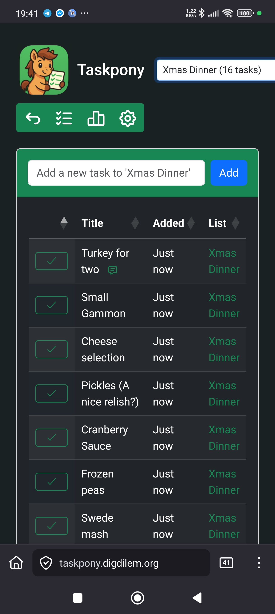
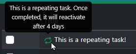
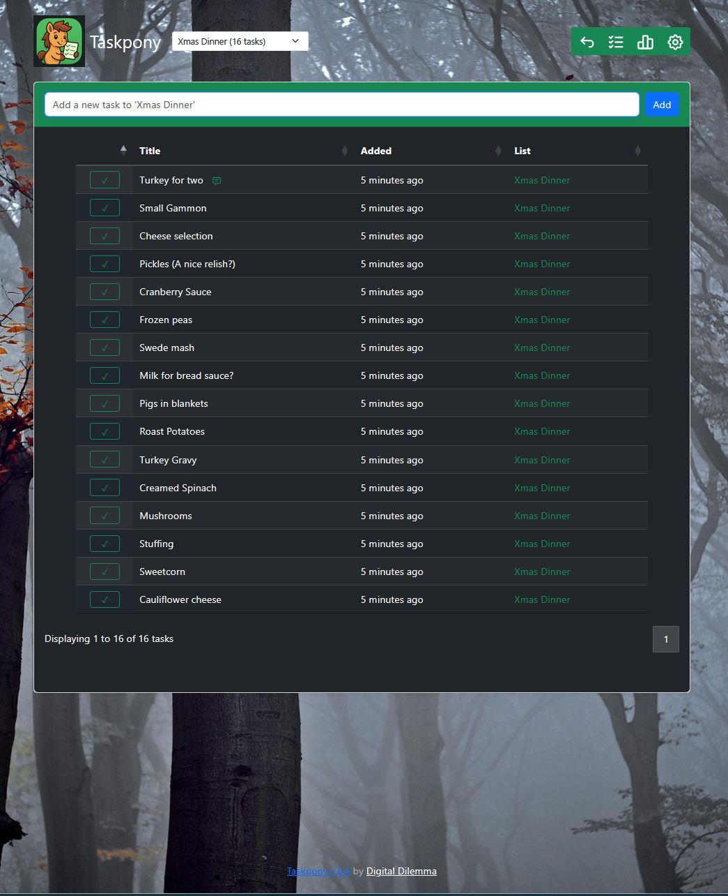
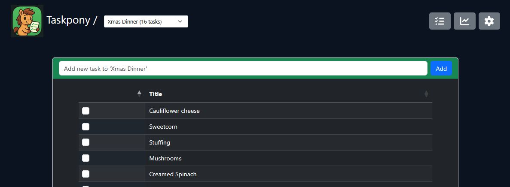
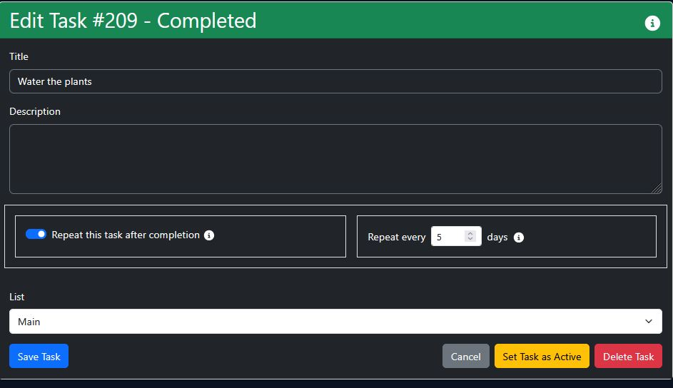
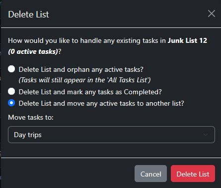
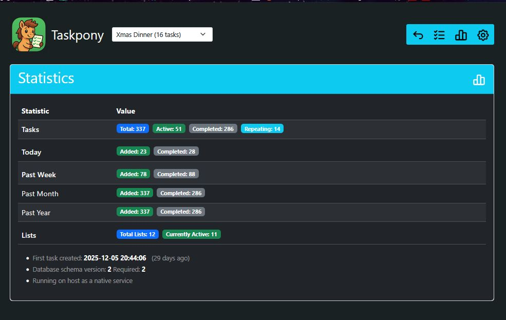

> "A small and simple self-hosted personal tasks organiser"

# TASKPONY

- **T** ransparent - Open source and openly described. Even the database schema is documented.
- **A** ir-gapped - Entirely self-contained. Runs without internet access, external services, or tracking.
- **S** imple - Easy to install, easy to understand, and easy to operate.
- **K** eep everything - Unlimited tasks and unlimited lists — no artificial limits.
- **P** rivate - Your data stays with you. No cloud, no telemetry, no external dependencies. 
- **O** pen - Export tasks to CSV, PDF, clipboard, or print cleanly.
- **N** o clutter - A focused interface that shows only what you actually need.
- **Y** ours - Free to use and always will be. No commercial edition, no hosted version.


| Desktop View                                                | Mobile View                                      |
|-------------------------------------------------------------|--------------------------------------------------|
|  |  |


# Features

Taskpony supports unlimited Tasks organised within unlimited Lists, repeating tasks and free movement of tasks within Lists. Tasks can be exported to the clipboard, CSV, PDF or cleanly printed. 

No phone app required. The interface is responsive and scales well to all devices. There are no trackers and does not require access to the internet to function as all required files are included. 

See some more [Screenshots](#screenshots)

# Demo

We have a demo instance [available here](https://qualified-eleanore-digital-dilemma-fc08fc19.koyeb.app/) so you can see and use Taskpony in action!

(This instance resets frequently, losing all its data - do not use for real!)

# Quick start

Deploy using [Docker Compose](#docker-compose-recommended) and visit port 5000

## Table of contents 

- [Features](#features)
- [Demo](#demo)
- [Quick Start](#quick-start)
- [Table of Contents](#table-of-contents)
- [Installation](#installation)
  - [](#docker-compose-recommended)
  - [](#docker)
  - [](#linux-service)
- [Security](#security)
- [FAQ](#faq)
- [Upgrading](#upgrading)
  - [Version History / Releases](docs/release-notes.md)
- [Documentation](#documentation)
  - [About Tasks](#about-tasks)
  - [About Lists](#about-lists)
  - [Schema](docs/database-schema-docs.md)
  - [Web paths](docs/web-endpoints.md)
- [Backups](#backups)
- [Goals](#goals)
  - [Supporting Taskpony](#support)
  - [Roadmap](docs/roadmap.md)
- [Screenshots](#screenshots)
- [Credits](#credits)
- [Licence](#licence)

# Installation

Taskpony is intended to be easy to install and maintain. We document two ways to install it, using [Docker Compose](#docker-compose), [Docker](#docker) or as a standalone Linux [systemd service](#linux-service)

## Docker Compose [Recommended]

There is an example `docker-compose.yml` file in the repository which should work for most situations.

Copy this to your chosen directory, inspect and adjust as desired, and run: `docker compose up -d`

On completion, Taskpony should be available on http://localhost:5000 

The default version mounts a persistant volume in `./data` where the Sqlite database `taskpony.db` will be created automatically.

### Troubleshooting Docker Compose

1. View output logs with `docker compose logs` from the directory the `docker-compose.yml` file is in.

## Docker

> The latest version of Taskpony is on [Dockerhub](https://hub.docker.com/repositories/digdilem) as `digdilem/taskpony:latest`

Install docker and run something like the following. 

`docker run -d -p 5000:5000 digdilem/taskpony:latest`

Within a few seconds, Taskpony should be available to your web browser on port 5000

If you want it to run on a different port, change the *first* 5000 to something else.

### Troubleshoooting Docker

1. Find the container id with `docker ps` (the random string left of `digdilem/taskpony:latest `)
2. View output logs with `docker logs STRING`  - replacing STRING with the above.

## Linux Service

### Installing the program

1. Change to `/opt` and install `git` if it isn't already. Then pull the files in from Github

```
cd /opt
git clone https://github.com/digdilem/taskpony.git
```

2. Install the perl modules that taskpony requires

Debian 13

```
apt-get install libdbi-perl libdbd-sqlite3-perl libplack-perl perl
```

RHEL, Rocky, Alma (EL distros)

```
dnf install perl-Plack perl-DBI perl-DBD-SQLite
```

For other distros, then cpan or cpanm could be used to install these:

```
Plack::Request
Plack::Response
Plack::Builder
DBI
```

3. Copy the supplied `taskpony.service` to `/etc/systemd/system` and start and enable it

```
cp /opt/taskpony/taskpony.service /etc/systemd/system
systemctl daemon-reload
systemctl enable --now taskpony
```

4. Visit port 5000 of that machine with your web browser. Eg, if it's localhost: `http://localhost:5000` and you should see Taskpony initial list.

Or if it's on a machine with, say, an IP of 10.0.0.16, then `http://10.0.0.16:5000`

### Notes:

If you want to use another port instead of 5000, edit `taskpony.service` and change the plackup line. Eg: `ExecStart=/usr/bin/plackup -r -p 5001 /opt/taskpony/taskpony.psgi`

If you wish to run Taskpony in a directory other than `/opt/taskpony`, then change `$db_path` in `taskpony.psgi` and `WorkingDirectory` in `taskpony.service`

Taskpony expects to be installed in `/opt/taskpony`. If you want it to exist elsewhere, you'll need to:

1. Edit `taskpony.psgi` and change `my $db_path = '/opt/taskpony/db/taskpony.db';` to point to the intended location of the database file that Taskpony will create.

2. Amend `taskpony.service` and change these lines to match your new path:

```
ExecStart=/usr/bin/plackup -r -p 5000 /opt/taskpony/taskpony.psgi
WorkingDirectory=/opt/taskpony
```

### Troubleshooting

See output logs with `journalctl -u taskpony` or the current status with `systemctl status taskpony`

# Security 

Part of Taskpony's design choice is that there are no authentication systems built in. If you require authentication, such as a multi-user LAN or you are accessing Taskpony from the internet, you are strongly encouraged to use a reverse proxy with authentication in front of it. This could be [Nginx Proxy Manager](https://nginxproxymanager.com/), [Apache](https://httpd.apache.org/) configured to operate with a reverse proxy, or a cloud solution such as [Cloudflare Tunnels](https://www.cloudflare.com) protected by an Access policy.

# FAQ

> Can I tell you about bugs or suggest improvements? 

Please do! The best place is to use [Github issues](https://github.com/digdilem/taskpony/issues) and raise a `New Issue`

> How do I back up my tasks?

All tasks, lists and settings are kept within the single file, `taskpony.db` stored in `/opt/taskpony/db` (Local if systemd, within `./data` if docker). This can be copied somewhere safe to back it up. If you need to restore a backup, just stop Taskpony, copy that file to where Taskpony expects it and restart Taskpony.

> Is there an Android or IOS app?

Sorry, no. Taskpony was designed to be a responsive web app and works well on both desktop and smaller devices, so an app is not considered necessary. (If you use a phone for your tasks as I do, create a shortcut on the desktop to Taskpony so it instantly opens in a browser)   If anyone wants to create an app for Taskpony, that's great, and if it's good then let me know and I'll reference it here.

> When will support for multiple users, groups or teams be added?

Never, sorry. This is a hard design choice to keep Taskpony small and simple and to avoid bloat. There are a lot of alternative projects with groupware ability if it is important to you.

> But I really want to run a copy for more than one person!

One way around this is to run multiple instances using docker, each with their own port.

> How do I add HTTPS? 

Use a reverse proxy - see [#security](#security)

> How do I protect my Taskpony with a username and password?

Use a reverse proxy - see [#security](#security)

> Does Taskpony support Caldav?

No. It may do in the future but there are no initial plans to do so.

> Can I use a different database type?

Not presently. SQLite was chosen to keep things small and simple. I think it should suffice for a task application.

# Upgrading

Upgrading Taskpony should be quite simple - overwrite the files and ensure taskpony.db survives. 

## Linux Systemd Service

1. Read the [Release Notes](docs/release-notes.md) for any breaking changes
2. Make a copy of the old `/opt/taskpony` directory, especially the `db/taskpony.db` database as a backup.
3. Download the latest files from https://github.com/digdilem/taskpony/ (Code -> Download ZIP)
4. Unzip its contents into /opt/taskpony, overwriting the existing Taskpony files.

Taskpony should restart itself automatically when its own file changes, this will be shown in its log with `-- /opt/taskpony/taskpony.psgi updated`. If there are any issues, restarting Taskpony with `systemctl restart taskpony` is advised.

If the upgrade includes any database schema changes, Taskpony should automatically detect and apply any updates when it's first started, see logs. `journalctl -u taskpony`

## Docker

Stop the existing container and repeat the installation instructions to pull the new image.

## Docker-Compose

Change to the directory you put your `docker-compose.yml`

Cmpare the compose file with that of the new version to see if there are any changes required.

```
docker compose down
docker compose pull
docker compose up -d
```

# Documentation

Follow the [install guides](#installation) above, and you should be able to access Taskpony on http port 5000 with your web browser.

## About Tasks

The default page shows a pulldown menu at the top with an entry for the Default List (change this in the Lists page) followed by "All Lists" followed by an alpha-sorted list of the remaining Lists.

Below that is a quick entry form that allows you to add a task to the current list. Because it's autofocused, you can enter multiple tasks by typing, hitting enter, then typing the next one without needing to reselect it with the mouse. This form will be missing if "All lists" is selected. 

Then the main tasks lists is shown. Tick the checkbox to mark a task as *completed* which removes it from the *active* tasks. 

To reduce clutter, the dates and list name for tasks can be hidden in the main tasks list be disabling  `Show Dates and Lists in Tasks Table` in Settings.

A Filter or Search box is displayed top right if `Display Search Box` is selected in Settings that will only display matching strings.

Hover over the task Title to see a popup of the task's description if one was set. Tasks can be edited, and descriptions added to them, by clicking the title and completing the resulting form.

The tasks list can be sorted by clicking the header values.

If there are enough tasks to trigger the `Number of Tasks to show on each page` value in Settings, then the list will automatically paginate and show the number of pages together with Next/Previous buttons below it.

If `Display export buttons` is selected in Settings, then extra "Export" buttons appear under the list. These are:


- `Copy` = Copy the contents of the List into the clipboard, allowing you to paste it elsewhere.
- `CSV` = Triggers a download of the chosen tasks as a CSV file allowing you to import them into a spreadsheet. 
- `PDF` = Generates a PDF of the tasks and downloads it.
- `Print` = Creates a clean, printable page and triggers the Print dialog, allowing you to make the tasklist physical. (Such as printing out a shopping list)

To change the view from active to completed tasks, use the curled arrow button above the list. Completed Tasks can be reverted to Active with the curled undo arrow next to them in the list.

### Repeating Tasks



Tasks can be set to repeat a set number of days after completing. This is useful for tasks that need to be done every NN days - watering the plants, taking the bins out and so on. 

To enable this, create a task as normal and then click on it to Edit the task, then you can check these two fields to enable Repeat behaviour and set the number of days. 


When this task is next checked as completed, it will disappear as normal. Once that number of days has passed, it will re-appear in the list as before.

To stop a task for repeating, you can either 

- Edit the Task, Untick the `Repeat this Task` box, or
- Edit the Task and click `Delete Task` to permanently remove it.

## About Lists

The header shows a Lists button at the top right which takes you to `/lists` where you can manage Taskpony's Lists.

Here you can see all the Lists along with how many tasks, active or completed, within each.

You can edit any List by clicking on its title.

The `Default` button allows you to select a Default List. The Default List appears at the top of the Lists Picklist in the header.

If a Default List is deleted, Taskpony will automatically select the oldest active list and make that default to avoid being without one. 

When a List is chosen from the picklist, it will be automatically chosen on subsequent task list reloads until another is selected. 

Lists are Alpha-sorted and are case sensitive, so 'A-Z' then 'a-z'

## Backups

Each day, Taskpony will automatically make a backup of its database by copying `taskpony.db` to `taskpony.db.0`, and rename any previous backups incrementally (.1 to .2, .0 to .1 etc) You can configure how many backups to keep in Settings -> `Number of daily database backups to keep`. 

Restoring a database is a manual process:

1. Stop Taskpony. (Either `systemctl stop taskpony` or if Docker, change to the compose location and `docker compose down`)
2. Change to the directory containing taskpony.db (`cd /opt/taskpony/db` or if docker `cd data`)
3. Move the existing taskpony.db elsewhere (`mv taskpony.db taskpony.db.old`)
4. Copy the chosen backup to taskpony.db (`cp taskpony.db.3 taskpony.db`)
5. Restart Taskpony and it should now be using the restored database. 

Any issues during this process are likely to be file or permission related, and Taskpony should show them in its console. (`journalctl -u taskpony` or `docker compose logs`)

Because Taskpony's database is a simple sqlite3 file, it would be possible to automate this process allowing some interesting thoughts about resetting a demo instance or swapping datasets around for some purpose.

## Goals

- Be easy for any user to pick up and use. Features should be self explaining as much as possible.
- Be a small, fast and responsive web based app that is usable on all devices by a standard browser. 
- Remain focused on providing single user Tasks and Lists. 
- Be free and open in all senses of the word. No telemetry, no lock-in, no registration, no freemium models.
- Be linux native or docker for easy self-hosting.
- Remain simple to install and update, with automated database upgrades.

## Non-goals
- Not become over featured.
- Not spread into Teamware or become group-based.
- Not add complex systems like Gantt Charts, Kanbans etc. 

## The Name? 
 - This software was written on Dartmoor in England. There is a Dartmoor Pony grazing outside of my window as I write this. Dartmoor Ponies are compact, tough and hard working. Also, cute.

 ## Support

In terms of helping the project, then filing Bug Reports and Suggestions for improvement via the [Issues](http://gitea.digdilem.org/flash/taskpony/issues) system is very helpful. 

It's not necessary to pay to use Taskpony but  but if you wish to show appreciation, then thank you!

<a href="https://www.buymeacoffee.com/digdilem">
  
</a>

# Screenshots















# Credits

Taskpony is built with the help of this great FOSS software:

- [Perl 5](https://www.perl.org/)
- [Plack](https://plackperl.org/)
- [SQLite](https://sqlite.org/index.html) 
- [Bootstrap 5](https://getbootstrap.com/) (Bundled)
- [JQuery](https://jquery.com/) (Bundled)
- [Datatables](https://datatables.net/) (Bundled)
- [Fontawesome](https://fontawesome.com/) (Embedded SVGs)
- [Tyna_Janoch](https://pixabay.com/photos/forest-nature-trees-beech-autumn-7573541/) for the example background image


# Licence

Taskpony is released under the MIT Licence. 

You may use, copy, modify, and distribute your code for any purpose, as long as they include my original copyright notice and licence text.

\# End of file
